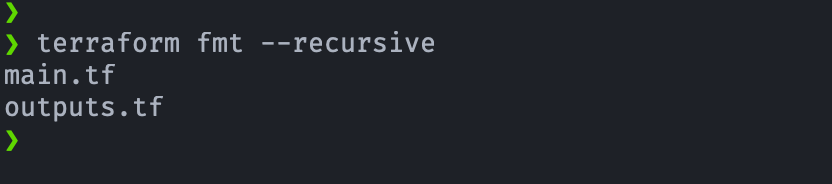
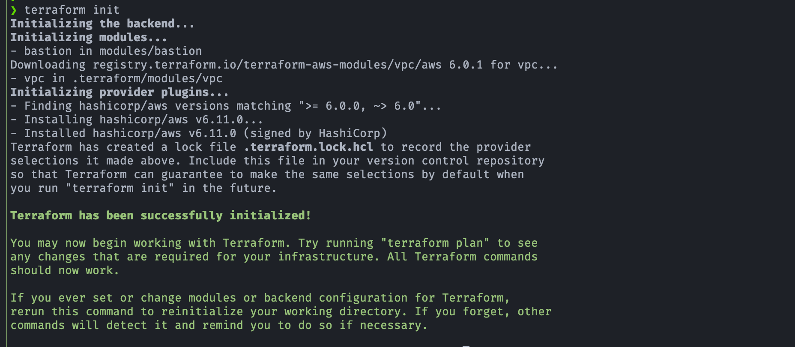
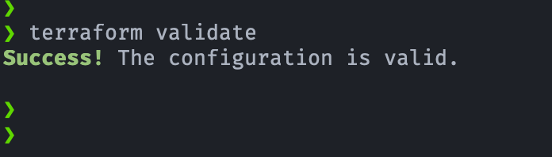
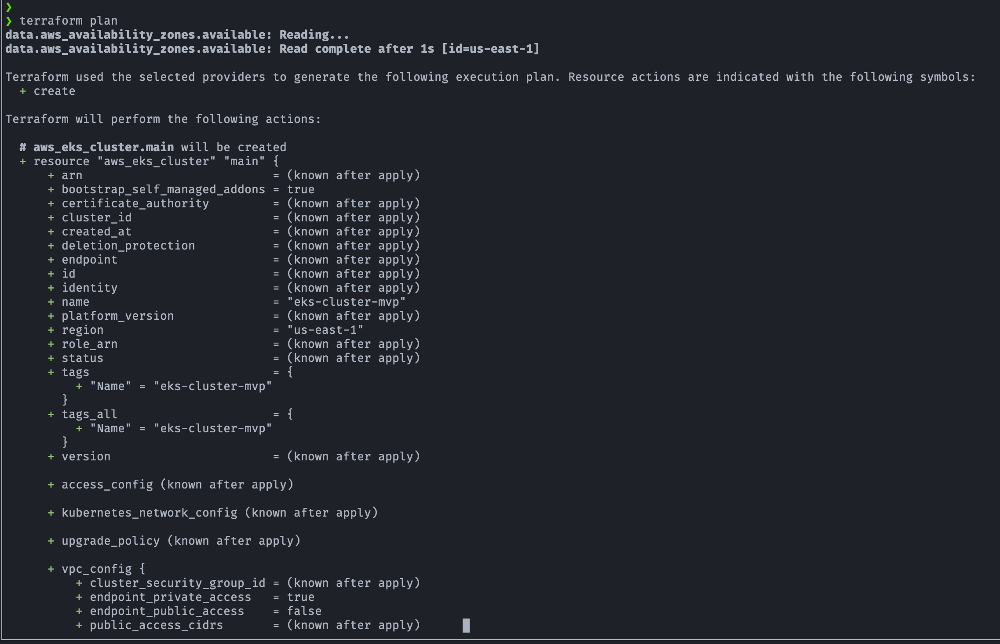
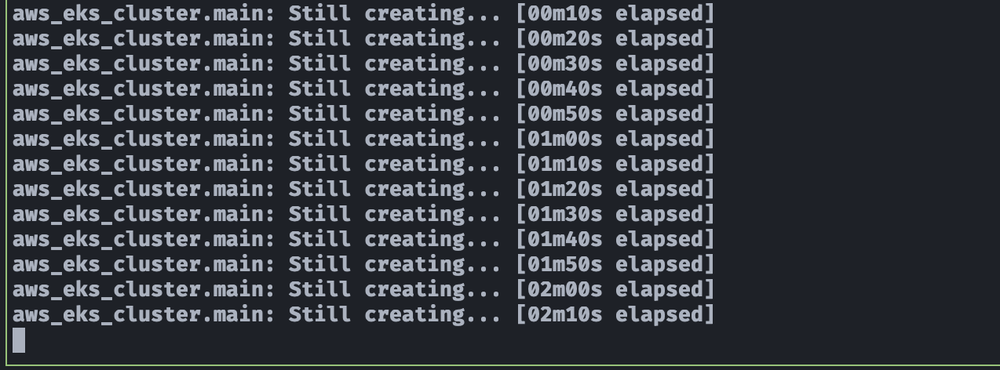

## 🧪 Laboratorio: Despliegue de Cluster EKS en AWS usando Terraform

> 🚀 Laboratorio EKS con Terraform: despliega un cluster funcional de Kubernetes en AWS, con red, IAM y nodos, listo para explorar Infraestructura como Código (IaC).

## 🎯 Objetivos del laboratorio
- MVP del cluster AWS EKS: Cluster gestionado con nodos EC2 escalables, VPC segura, roles IAM configurados, add-ons esenciales de Kubernetes y soporte opcional para volúmenes persistentes. Listo para desplegar aplicaciones de forma segura y escalable.

## ⚡ Características del MVP del cluter AWS EKS
- Cluster EKS gestionado listo para producción
- Nodos EC2 escalables (Spot)
- VPC segura con subnets privadas y públicas
- Security Groups configurados para nodos y servicios
- Roles IAM configurados para cluster y nodos
- Add-ons esenciales: CNI, CoreDNS, kube-proxy
- Opcional: EBS CSI Driver para volúmenes persistentes
- Métricas y logs integrados con CloudWatch

## ⚙ Tecnolgías usadas
- **Amazon Web Services (AWS)**: La plataforma cloud donde se despliega la infraestructura.
- **Amazon EKS**: El servicio de Kubernetes gestionado de AWS.
- **Terraform**: La herramienta de IaC (Infraestructura como Código) utilizada para aprovisionar los recursos.
- **kubectl**: La herramienta de línea de comandos para interactuar con el clúster de Kubernetes.

## 🛠 Recursos de AWS generados
### Recursos declarados directamente en Terraform
- Módulo oficial de EKS (terraform-aws-eks)
- Configuración de VPC y subnets
- Roles IAM y políticas básicas para nodos y cluster
- Definición de nodos (ASG EC2) y opciones de escalabilidad
- Parámetros de add-ons opcionales (ej. AWS EBS CSI Driver)
### Recursos creados internamente por el módulo
- Cluster EKS gestionado con endpoint y certificado de CA
- Auto Scaling Groups y Launch Templates para nodos
- IAM Roles y Policies necesarios para nodos y control plane
- Add-ons esenciales de Kubernetes: CNI, CoreDNS, kube-proxy
- Integración opcional con CloudWatch para métricas y logs
- Soporte para IRSA (IAM Roles for Service Accounts)
- Recursos auxiliares necesarios para la gestión del cluster (Security Groups internos, subnets privadas si no se crean explícitamente)

## 🚀 Demostración y prueba del laboratorio
### 1. Validar el código HCL de Terraform antes del despliegue
1. Terraform fmt --recursive

    

2. Terraform init

   
3. Terraform validate

    
4. Terraform plan

### 2. Desplegar recursos
1. Creanddo AWS EKS Cluster:

---

## 🔗 Referencias
- [Amazon EKS Best Practices Guide](https://docs.aws.amazon.com/eks/latest/best-practices/introduction.html)
- [Tag subnets for EKS Auto Mode](https://docs.aws.amazon.com/eks/latest/userguide/tag-subnets-auto.html)
- [VPC and Subnet Considerations](https://docs.aws.amazon.com/eks/latest/best-practices/subnets.html)
- [Route application and HTTP traffic with Application Load Balancers](https://docs.aws.amazon.com/eks/latest/userguide/alb-ingress.html)
- [Route TCP and UDP traffic with Network Load Balancers](https://docs.aws.amazon.com/eks/latest/userguide/network-load-balancing.html)
- [Organize Amazon EKS resources with tags](https://docs.aws.amazon.com/eks/latest/userguide/eks-using-tags.html)
- [GitHub - EKS Best Practices Guide](https://github.com/aws/aws-eks-best-practices)

---